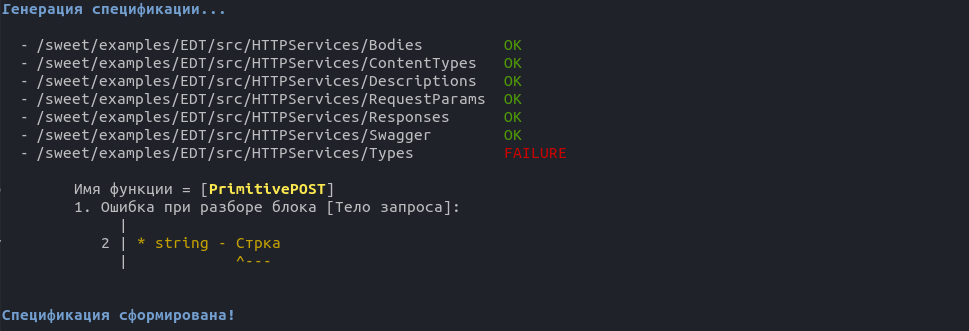

#  Генератор спецификации

Доступны 2 вида приложения: 
- **[sweet-cli](./sweet-cli.md)** 
- **[sweet-gui](./sweet-gui.md)**

Принцип работы приложений одинаковый.

#### 1. Анализ метаданных

Приложение, в указанной пользователем папке, ищет файлы проектов 1С, относящиеся к http-сервисам. В одной папке могут быть как файлы конфигурации, так и расширений - все http-сервисы будут проанализированы и сгенерированы в одну спецификацию. 

Приложение сначала пытается найти файлы проекта EDT и если находит, то не ищет дальше файлы, выгруженные из конфигуратора. Если файлов проекта EDT не найдено, то приложение ищет файлы выгруженные из конфигуратора и работает с ними. Иными словами приложение не работает, по крайней мере пока, одновременно с файлами разных типов. 

#### 2. Парсинг bsl файлов

Из bsl файлов парсится документирующий комментарий у функций-обработчиков http-запросов. Если комментария нет, то сервис будет в спецификации без структуры и описания.

Если при парсинге комментариев будут найдены ошибки, то раздел комментария с ошибками не попадет в спецификацию. Будет сгенерировано сообщение, в которое попадает информация о разделе комментария, номер строки раздела и имя функции.
Приложение спотыкается о первую ошибку в разделе, не анализирует раздел текущего комментария дальше, а переходит к следующему разделу.

#### 3. Генерация и сохранение спецификации

Приложение генерирует Swagger (OpenApi) спецификацию версии 3.0.3, записывает результат в json-файл в папку, указанную пользователем.

Пример результата работы cli-приложения:

