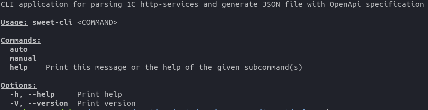
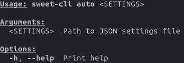
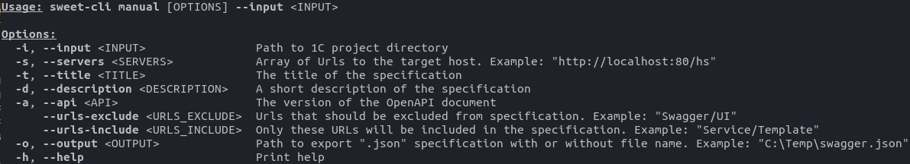

# sweet-cli

Доступны 2 режима использования приложения:

1. **auto** - на основании [json-файла с настройками](settings-json.md), который содержит в себе все необходимые поля для генерации спецификации. 

2. **manual** - каждый параметр задается вручную 

#### Результат работы приложения: ###

Сгенерированный json-файл спецификации сохраненный по адресу, который был указан в параметре *--output*
