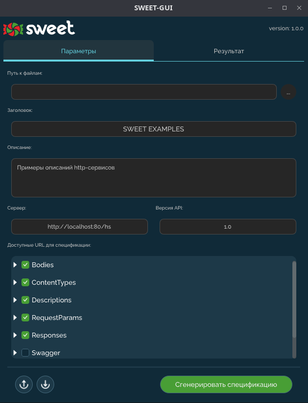

# sweet-gui

Десктопное приложение может выполнять следующие функции:

1. Импорт/Экспорт [json-файла](settings-json.md) с настройками для его использования в [sweet-cli](), а также для автозаполнения полей приложения (при многоразовом использовании приложения для конкретной базы). 

Функции доступны по кнопкам: 

2. Генерация спецификации по указанным параметрам. Результат можно сохранить в файл, а можно скопировать в буфер обмена, для последующей загрузки в [editor.swager.io](https://editor.swagger.io)

