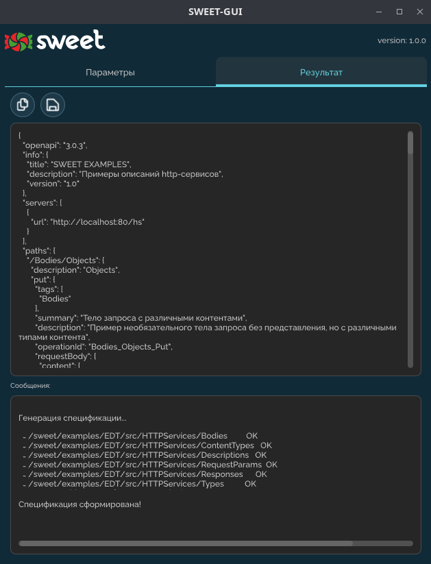

# sweet-gui

Форма приложения разбита на 2 вкладки:

- ### **Параметры**

В ней указываются параметры для генерации спецификации, а также есть возможность исключить URL из спецификации

#### Команды:

1. импорт/экспорт [json-файла с настройками](settings-json.md) для его использования в [sweet-cli](), а также для автозаполнения полей gui приложения (при многоразовом использовании приложения для конкретной базы). 

Функции доступны по кнопкам: 

2. При нажатии на кнопку "Сгенерировать спецификацию" будет сгенерирована спецификации по указанным параметрам. 

- ### **Результат**

Cостоит из 2-х многострочных текстовых полей. В одном сама спецификация, а во втором сообщения, сформированные при генерации.

#### Команды:

Результат можно сохранить в файл, а можно скопировать в буфер обмена, например, для последующей загрузки в [editor.swager.io](https://editor.swagger.io).

Функции доступны по кнопкам:

Работа сочетаний клавиш Ctrl+A, Ctrl+C доступна при английской раскладке клавиатуры.
