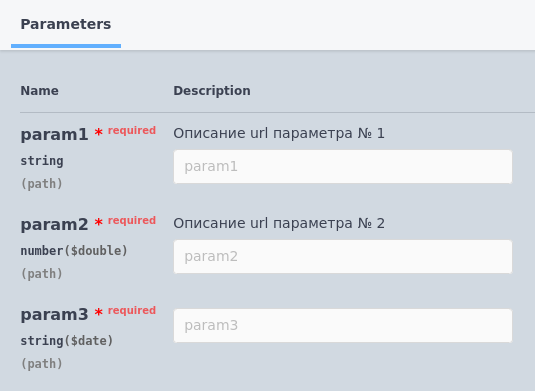

# Параметры URL (path)

Формат записи:
```
//  Параметры URL:
//      *   [ИмяПараметра] - [ТипПараметра] - [ОписаниеПараметра]
```
> **[ИмяПараметра]** - имя параметра (без спец.символов)

> **[ТипПараметра]** - [тип](../Типы/README.md) параметра

> **[ОписаниеПараметра]** - необязательное многострочное описание параметра

Пример:
```
//	Параметры URL:
//		* param1 - Строка - Описание url параметра № 1
//		* param2 - Число - Описание url параметра № 2
//		* param3 - Дата
```



[Другие примеры](../../examples/EDT/src/HTTPServices/RequestParams/Module.bsl)
