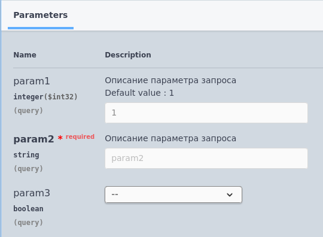

# Параметры запроса (query)

Формат записи:
```
//  Параметры запроса:
//      *   [ИмяПараметра] ([Характеристика]) - [ТипПараметра] - [ОписаниеПараметра]. [ЗначениеПоУмолчанию]
```
> **[ИмяПараметра]** - имя параметра (без спец.символов)

> **[Характеристика]** - характеристика параметра:

- Обязательный - параметр помечается как обязательный для заполнения

> **[ТипПараметра]** - [тип](../Типы/README.md) параметра

> **[ОписаниеПараметра]** - необязательное многострочное описание параметра

> **[ЗначениеПоУмолчанию]** - значение параметра по умолчанию, если оно не указано. Начинается с ключевого слова `По умолчанию:`, после которого следует значение.

Пример:
```
//	Параметры запроса:
//		* param1 - ЦелоеЧисло - Описание параметра запроса. По умолчанию: 1
//		* param2 (Обязательный) - Строка - Описание параметра запроса
//		* param3 - Булево
```



[Другие примеры](../../examples/EDT/)
