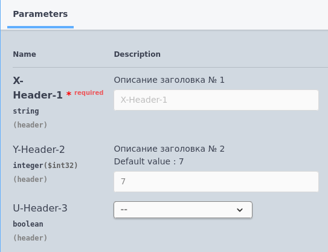

# Заголовки (headers)

Формат записи:
```
//  Заголовки:
//      * [ИмяЗаголовка] ([Характеристика]) - [ТипЗаголовка] - [ОписаниеЗаголовка]. [ЗначениеПоУмолчанию]
```
> **[ИмяЗаголовка]** - имя заголовка (без спец.символов)

> **[Характеристика]** - характеристика заголовка:

- Обязательный - заголовок помечается как обязательный для заполнения

> **[ТипЗаголовка]** - [тип](../Типы/README.md) заголовка

> **[ОписаниеЗаголовка]** - необязательное многострочное описание заголовка

> **[ЗначениеПоУмолчанию]** - значение заголовка по умолчанию, если оно не указано. Начинается с ключевого слова `По умолчанию:`, после которого следует значение.

Пример:

 



[Другие примеры](../../examples/HTTPServices/RequestParams/Ext/Module.bsl)
