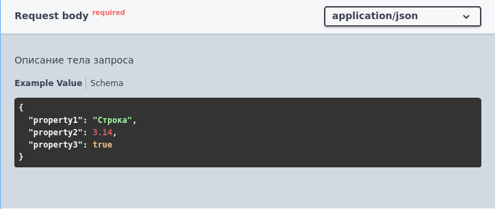
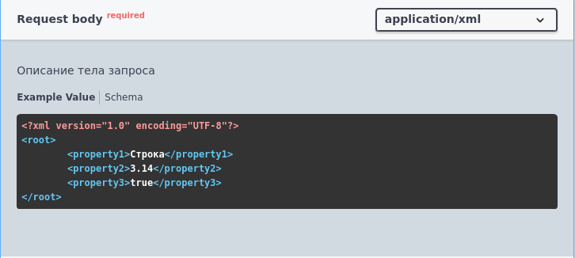
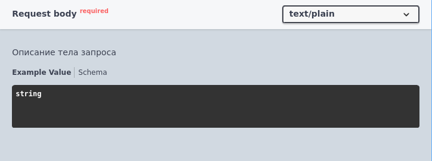

# Тело запроса (body)

Формат записи:
```bsl
//  Тело запроса:
//      [Характеристика] - [Описание]
//      [ТипКонтента] - [ТипЗначения]
```
> **[Характеристика]** - характеристика тела запроса:

- Обязательный - тело запроса помечается как обязательное для заполнения

> **[Описание]** - необязательное многострочное описание тела запроса

> **[ТипКонтента]** - [тип контента](../Типы/types/Типы%20контента.md)

> **[ТипЗначения]** - [тип значения](../Типы/README.md) тела запроса

Допускается указывать несколько типов контента и значений.

Пример:
```bsl
//	Тело запроса:
//		Обязательный - Описание тела запроса
//		application/json - Структура {
//			* property1 - Строка - Описание свойства. Пример: "Строка"
//			* property2 - Число. Пример: 3.14
//			* property3 - Булево
//		}
//		application/xml - Структура<имя = "root"> {
//			* property1 - Строка - Описание свойства. Пример: "Строка"
//			* property2 - Число. Пример: 3.14
//			* property3 - Булево
//		}
//		text/plain - Строка
```





[Другие примеры](../../examples/EDT/src/HTTPServices/Bodies/Module.bsl)
