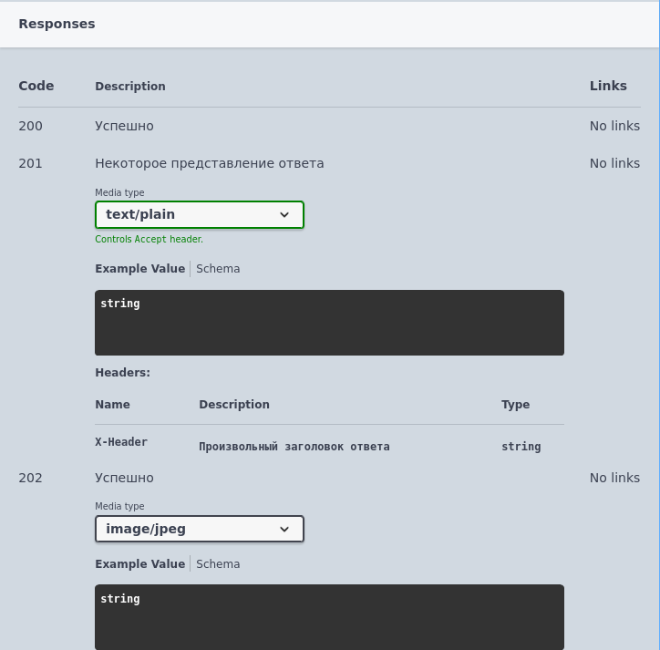

# Возвращаемые ответы (response)

Формат записи:
```
//  Возвращаемые ответы:
//      [КодСостояния] - [ТипКонтента] - [ТипЗначения].[Пример] - [Описание]
```
> **[КодСостояния]** - Код состояния возвращаемого ответа

> **[ТипКонтента]** - [тип контента](../Типы/types/Типы%20контента.md)

> **[ТипЗначения]** - [тип значения](../Типы/README.md) 

> **[Пример]** - [пример значения для представления в спецификации](../Типы/types/Примеры.md)

> **[Описание]** - необязательное описание возвращаемого ответа

Заголовки ответа, при необходимости, указываются для каждого кода состояния:
```
//  Возвращаемые ответы:
//      [КодСостояния] - [ТипКонтента] - [ТипЗначения].[Пример] - [Описание]
//      Заголовки ответа:
//          *   [ИмяЗаголовка] - [ТипЗаголовка] - [ОписаниеЗаголовка]  
```

> **[ИмяЗаголовка]** - имя заголовка (без спец.символов)

> **[ТипЗаголовка]** - [тип](../Типы/README.md) заголовка

> **[ОписаниеЗаголовка]** - необязательное многострочное описание заголовка

Допускается указывать несколько записей (типов контента и значения) для одного кода состояния.

Пример:
```
//	Возвращаемые ответы:
//		200 - Неопределено
//		201 - text/plain - Строка - Некоторое представление ответа
//		Заголовки ответа:
//			* X-Header - Строка - Произвольный заголовок ответа
//		202 - image/jpeg - ДвоичныеДанные
```



[Другие примеры](../../examples/EDT/src/HTTPServices/Responses/Module.bsl)
