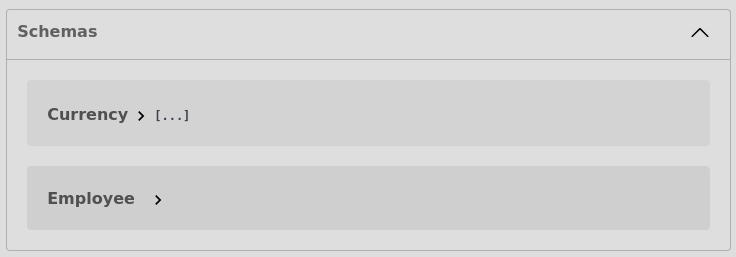
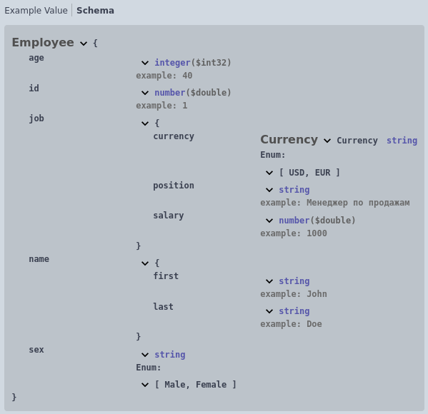
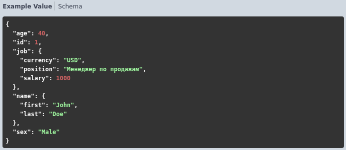

# Описание объектов

Отдельная область комментария в модуле http-сервиса (не относящаяся к документирующему комментарию и не являющаяся его разделом), в которой перечислены имена объектов и их структура. 

В дальнейшем эти имена объектов можно использовать с типом [Объект](../Типы/types/Сложные%20типы.md)

Использовать эту область предполагается в следующих случаях:

1. При многократном использовании одних и тех же типов в разных сервисах (чтобы не добавлять описание типа в каждый комментарий)
2. Описание типа слишком объемно (количество строк документирующего комментария должно быть как можно меньше - это улучшает чтение и поддержку)

#### Область должна быть одна на весь модуль, располагаться она может в любом месте модуля, но для порядка лучше ее расположить в самом начале модуля.

Формат записи:

```
Описание объектов:
    [ИмяОбъекта] - [Тип]
```
> **[ИмяОбъекта]** - может состоять из латинских букв, цифр и символа "_". <u>Имя объекта должно быть уникальным для всей конфигурации (спецификации)!</u>

> **[Тип]** - доступные типы:
- Структура 
- Соответствие
- Перечисление

Пример:

 

Описанные объекты в этой области в спецификации попадают в секции "Schemas"


Использование объектов в документирующем комментарии:

 

  

[Другие примеры](../../examples/HTTPServices/ContentTypes/Ext/Module.bsl)
