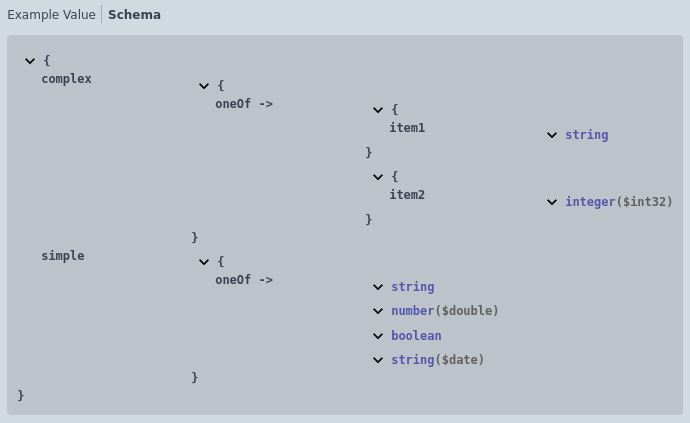
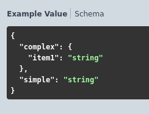
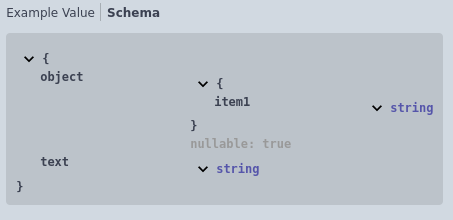
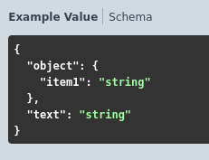
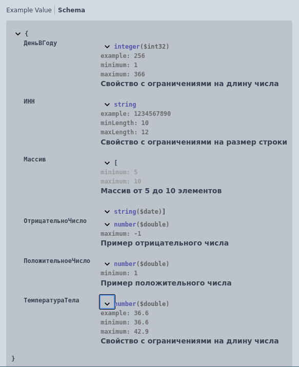
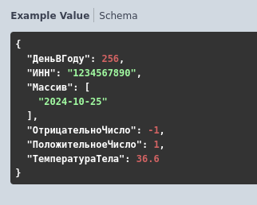

# Дополнительно

## Составные типы

Доступно использование составных типов.

Формат записи:

```
[Тип1],[Тип2],...[ТипN]
```

Пример:
```
//	Тело запроса:
//		application/json - Структура {
//			* simple - Строка,Число,Булево,Дата
//			* complex - Структура {
//				* item1 - Строка
//			},Структура {
//				* item2 - ЦелоеЧисло
//			}
//		}
```
  


## Тип-маркер
 - Неопределено - не является самостоятельным типом, а является маркером того, что значение может быть равно null.

Формат записи:

```
[Тип],Неопределено
```
Пример:
```
//	Тело запроса:
//		application/json - Структура {
//			* text - Строка
//			* object - Неопределено,Структура {
//				* item1 - Строка
//			}
//		}
```
  

## Ограничения типов

Формат записи:

```
[Тип](Минимум:[Количество], Максимум: [Количество])
```
> **[Тип]** - ограничения доступны для следующих типов:

- Строка
- Число
- ЦелоеЧисло
- Массив

Ограничения добавляются в описание при необходимости, они не являются обязательными.

Пример:
```
//	Тело запроса:
//		application/json - Структура {
//			* ИНН - Строка(Минимум: 10,Максимум: 12) - Свойство с ограничениями на размер строки. Пример: "1234567890"
//			* ДеньВГоду - ЦелоеЧисло(Минимум: 1,Максимум: 366) - Свойство с ограничениями на длину числа. Пример: 256
//			* ТемператураТела - Число(Минимум: 36.6,Максимум: 42.9) - Свойство с ограничениями на длину числа. Пример: 36.6
//			* ПоложительноеЧисло - Число(Минимум: 1) - Пример положительного числа
//			* ОтрицательноЧисло - Число(Максимум: -1) - Пример отрицательного числа
//			* Массив - Массив(Минимум: 5, Максимум: 10) из Дата - Массив от 5 до 10 элементов
//		}
```
  


[Другие примеры](../../examples/EDT/)
