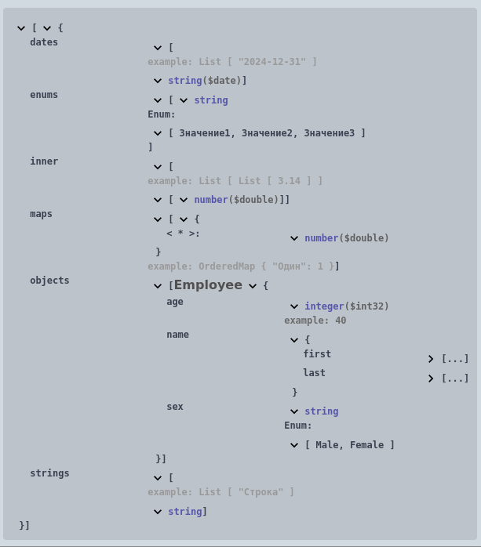
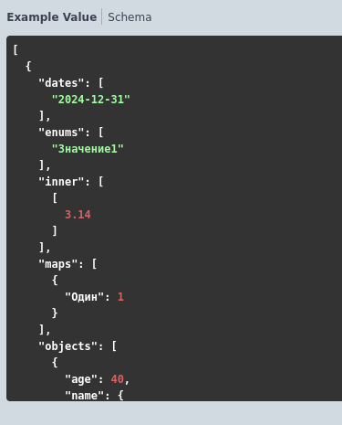

# Коллекции

- ## Массив 

Формат записи:

```
Массив из [Тип]
```

> **[Тип]** - простой/сложный тип или коллекция

Пример:
```bsl
//	Описание объектов:
//		Employee - Структура {
//			* name - Структура {
//				* last - Строка. Пример: "Doe"
//				* first - Строка. Пример: "John"
//			}
//			* age - ЦелоеЧисло. Пример: 40
//			* sex - Перечисление [
//				* Male
//				* Female
//			]
//		}
//
//	Тело запроса:
//		application/json - Массив из Структура {
//			* strings - Массив из Строка. Пример: "Строка"
//			* dates - Массив из Дата. Пример: "2024-12-31"
//			* enums - Массив из Перечисление [
//				* Значение1
//				* Значение2
//				* Значение3
//			]
//			* maps - Массив из Соответствие {
//				* Ключ - Строка. Пример: "Один"
//				* Значение - Число. Пример: 1
//			}
//			* objects - Массив из Объект(Employee)
//			* inner - Массив из (Массив из Число). Пример: 3.14
//		}
```

  

[Примеры](../../../examples/EDT/src/HTTPServices/Types/Module.bsl)