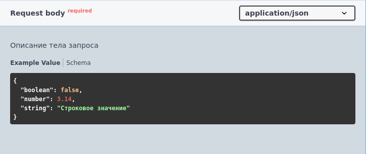
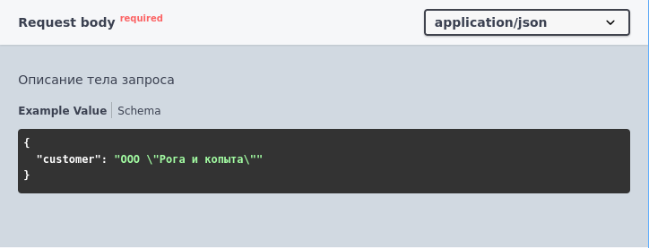

# Примеры

Начинается с ключевого слова `Пример:`, после которого следует значение (строка, число или булево).

Не указывается для сложных типов и коллекций из сложных типов.

Примеры:

 

### Ограничения:
Не поддерживаются вложенные `""`. 

Варианты решения:

 

