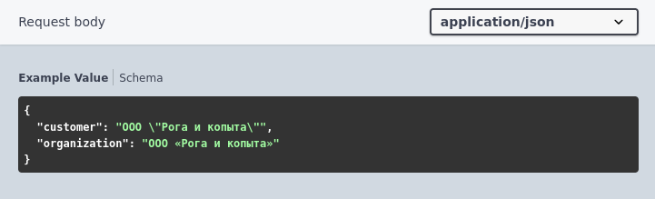

# Примеры

Начинается с ключевого слова `Пример:`, после которого следует значение (строка, число или булево).

Не указывается для сложных типов и коллекций из сложных типов.

Примеры:
```bsl
//	Тело запроса:
//		application/json - Структура {
//			* string - Строка. Пример: "Строковое значение"
//			* number - Число. Пример: 3.14
//			* boolean - Булево. Пример: Ложь
//		}
```


### Ограничения:
Не поддерживаются вложенные `""`. 

Вместо:

```bsl
// Пример: "ООО "Рога и копыта""
```

Можно указать:

```bsl
//	Тело запроса:
//		application/json - Структура {
//			* customer - Строка. Пример: ООО "Рога и копыта"
//		}
```

