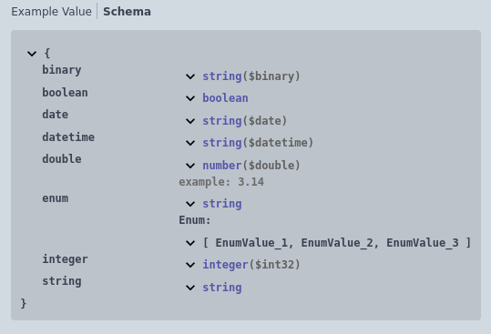
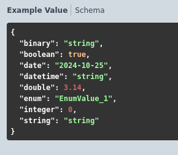

# Простые типы

- <u>Строка</u>
- <u>Число</u>
- <u>ЦелоеЧисло</u>
- <u>Булево</u>
- <u>Дата</u>
- <u>ДатаВремя</u>
- <u>ДвоичныеДанные</u>
- <u>Перечисление</u>

Пример:
```bsl
//	Тело запроса:
//		application/json - Структура {
//			* string - Строка
//			* double - Число. Пример: 3.14
//			* integer - ЦелоеЧисло
//          * boolean - Булево
//          * date - Дата
//          * datetime - ДатаВремя
//          * binary - ДвоичныеДанные
//          * enum - Перечисление [
//              * EnumValue_1   
//              * EnumValue_2
//              * EnumValue_3
//          ]
//		}
```

 

[Другие примеры](../../../examples/EDT/src/HTTPServices/Types/Module.bsl)
