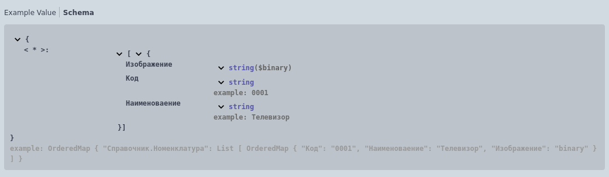

# Сложные типы
- ## Структура

Формат записи:

```
Структура {
     * [ИмяСвойства] ([Характеристики свойства]) - [Тип] - [Описание].[Пример]
}
```

> **[ИмяСвойства]** - имя свойства без пробелов и спец.символов

> **[Характеристики свойства]**:

 + <u>Обязательный</u> - пометка свойства как обязательное

 + <u>Атрибут</u> - пометка свойства, которое является атрибутом (для XML)

> **[Тип]** - простой/сложный тип или коллекция

> **[Описание]** - необязательное многострочное описание свойства

> **[Пример]** - [пример значения для представления в спецификации](../types/Примеры.md)

Обязательные поля: *[ИмяСвойства]*, *[Тип]*

Пример:
```
//	Тело запроса:
//		application/json - Структура {
//			* string(Обязательный) - Строка - обязательное и важное значение. Пример: "Строка"
//			* double - Число. Пример: 3.14
//          * boolean - Булево
//			* struct - Структура {
//				* integer - ЦелоеЧисло
//				* date - Дата
//              * datetime - ДатаВремя
//              * binary - ДвоичныеДанные
//			} - вложенная структура
//		}
```

  


- ## Соответствие
Формат записи:

```
Соответствие {
	* Ключ - [ТипКлюча] - [Описание].[Пример]
	* Значение - [ТипЗначения] - [Описание].[Пример]
}
```

> **[ТипКлюча]** - простой тип

> **[ТипЗначения]** - простой/сложный тип или коллекция

> **[Описание]** - необязательное многострочное описание

> **[Пример]** - [пример значения для представления в спецификации](../types/Примеры.md)

Пример:
```
//	Тело запроса:
//		application/json - Соответствие {
//			* Ключ - Строка. Пример: "Справочник.Номенклатура"
//			* Значение - Массив из Структура {
//				* Код - Строка. Пример: "0001"
//				* Наименоваение - Строка. Пример: "Телевизор"
//              * Изображение - ДвоичныеДанные
//			}
//		}
```

 


- ## Объект
Формат записи:

```
Объект([ИмяОбъекта])
```

> **[ИмяОбъекта]** - имя объекта, описание которого присутствует в отдельной области [описания объектов](../../Разделы/Описание%20объектов.md) модуля http-запроса.

Пример:
```
//	Описание объектов:
//		Employee - Структура {
//			* id(Атрибут) - Число. Пример: 1
//			* name - Структура {
//				* last - Строка. Пример: "Doe"
//				* first - Строка. Пример: "John"
//			}
//			* age - ЦелоеЧисло. Пример: 40
//			* sex - Перечисление [
//				* Male
//				* Female
//			]
//			* job - Структура {
//				* position - Строка. Пример: "Менеджер по продажам"
//				* salary - Число. Пример: 1000
//				* currency - Перечисление [
//					* USD
//					* EUR
//				]
//			}
//		}
```
```
//	Тело запроса:
//		application/xml - Объект(Employee)
```

 


- ## Произвольный
Формат записи:

```
Произвольный
```

Множественный тип, состоящий из следующих типов:
- Строка
- Число
- ЦелоеЧисло
- Булево
- Дата
- ДатаВремя
- Массив
- Структура

Пример:

```
//	Тело запроса:
//		application/json - Структура {
//	    	* some_type - Произвольный
//	    }
```

 

[Другие примеры](../../../examples/EDT/src/HTTPServices/Types/Module.bsl)
