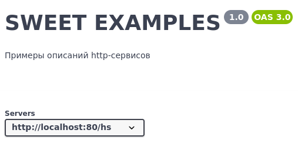

# sweet-settings

Файл можно использовать как в CLI, так и в GUI приложениях.

Структура файла:

- **input** - путь до папки с файлами конфигурации

- **title** - Заголовок спецификации

- **api** - Версия API

- **description** - Описание спецификации

- **servers** - Массив серверов публикации базы

- **urls** - Структура, состоящая из 2-х полей:

> include - Перечень сервисов, которые должны быть в спецификации. Только эти сервисы будут в спецификации, все остальные исключаются.

> exclude - Перечень сервисов, которые нужно исключить из спецификации. В спецификации будут присутствовать все сервисы, кроме перечисленных. 

Если использовать параметры _include_ и _exclude_ вместе, то в спецификации будут только те сервисы, что присутствуют в _include_ и из них будут исключены те сервисы, что присутствуют в _exclude_.

- **output** - путь до папки, в которую нужно сохранить спецификацию


Пример:

```json
{
  "input": "./",
  "title": "SWEET EXAMPLES",
  "api": "1.0",
  "description": "Примеры описаний http-сервисов",
  "servers": [
    "http://localhost:80/hs"
  ],
  "urls": {
    "exclude": [
      "Swagger"
    ]
  },
  "output": "./"
}
```

В Swagger UI данные из файла отображаются следующим образом:


