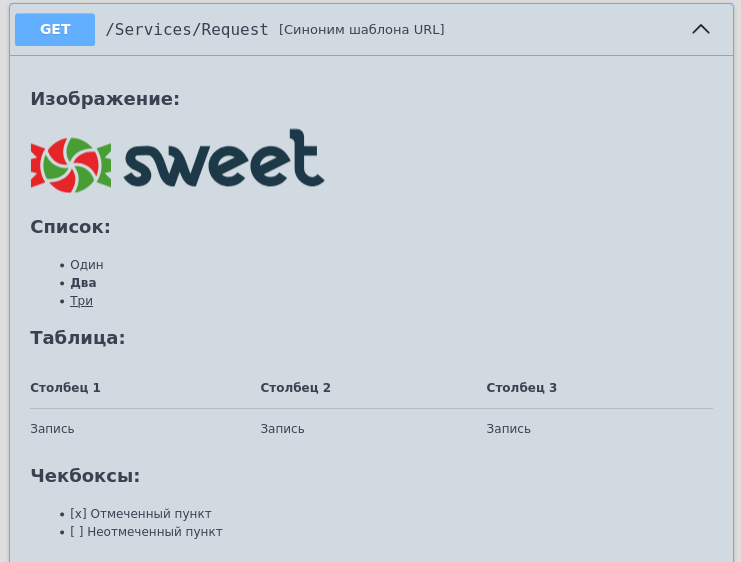

# Описание

Раздел комментария содержит в себе многострочное текствое описание сервиса.

Формат записи:

```bsl
//  Описание:
//      [Текст]
```

В описании используется язык разметки MarkDown

Пример:

 

