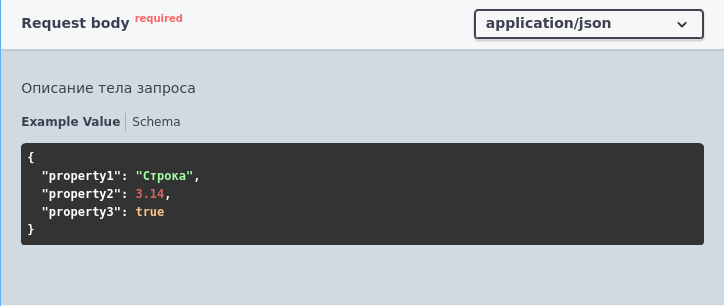
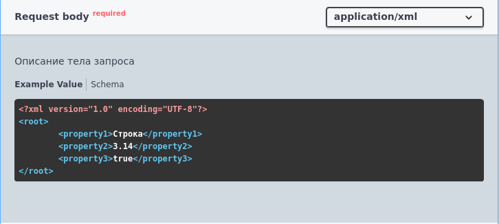
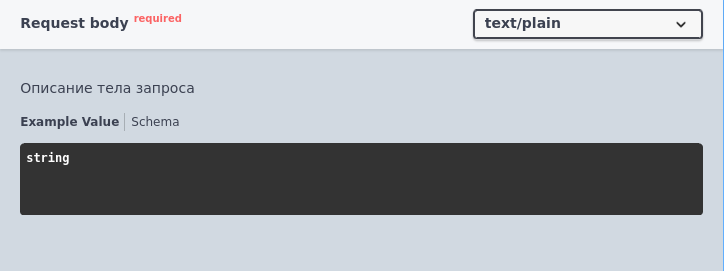

# Тело запроса (body)

Формат записи:
```
//  Тело запроса:
//      [Характеристика] - [Описание]
//      [ТипКонтента] - [ТипЗначения]
```
> **[Характеристика]** - характеристика тела запроса:

- Обязательный - тело запроса помечается как обязательное для заполнения

> **[Описание]** - необязательное многострочное описание тела запроса

> **[ТипКонтента]** - [тип контента](../Типы/types/Типы%20контента.md)

> **[ТипЗначения]** - [тип значения](../Типы/README.md) тела запроса

Допускается указывать несколько типов контента и значений.

Пример:

 





[Другие примеры](../../exts/EDT/src/HTTPServices/Bodies/Module.bsl)
