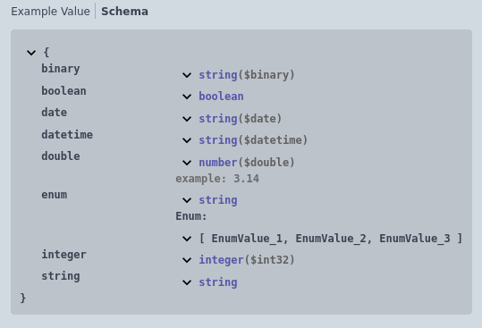
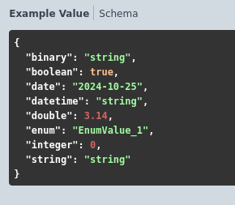

# Простые типы

- <u>Строка</u>
- <u>Число</u>
- <u>ЦелоеЧисло</u>
- <u>Булево</u>
- <u>Дата</u>
- <u>ДатаВремя</u>
- <u>ДвоичныеДанные</u>
- <u>Перечисление</u>

Пример:

 

 

[Другие примеры](../../../exts/EDT/src/HTTPServices/Types/Module.bsl)
