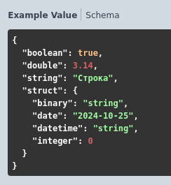
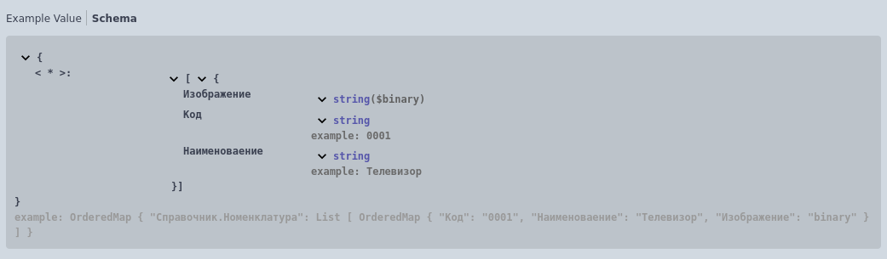
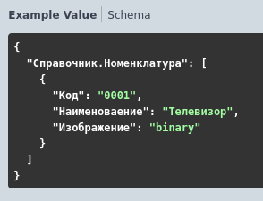
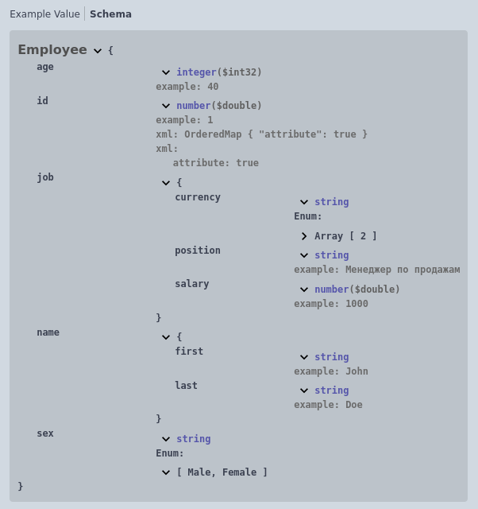
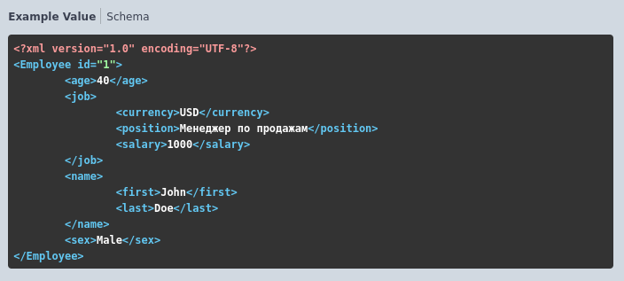
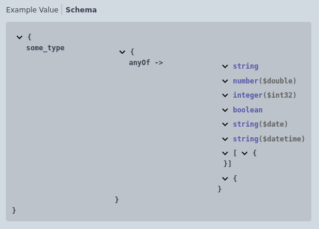
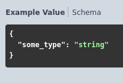

# Сложные типы
- ## Структура

Формат записи:

```
Структура {
     * [ИмяСвойства] ([Характеристики свойства]) - [Тип] - [Описание].[Пример]
}
```

> **[ИмяСвойства]** - имя свойства без пробелов и спец.символов

> **[Характеристики свойства]**:

 + <u>Обязательный</u> - пометка свойства как обязательное

 + <u>Атрибут</u> - пометка свойства, которое является атрибутом (для XML)

> **[Тип]** - простой/сложный тип или коллекция

> **[Описание]** - необязательное многострочное описание свойства

> **[Пример]** - [пример значения для представления в спецификации](../types/Примеры.md)

Обязательные поля: *[ИмяСвойства]*, *[Тип]*

Пример:

 

  


- ## Соответствие
Формат записи:

```
Соответствие {
	* Ключ - [ТипКлюча] - [Описание].[Пример]
	* Значение - [ТипЗначения] - [Описание].[Пример]
}
```

> **[ТипКлюча]** - простой тип

> **[ТипЗначения]** - простой/сложный тип или коллекция

> **[Описание]** - необязательное многострочное описание

> **[Пример]** - [пример значения для представления в спецификации](../types/Примеры.md)

Пример:

 

 


- ## Объект
Формат записи:

```
Объект([ИмяОбъекта])
```

> **[ИмяОбъекта]** - имя объекта, описание которого присутствует в отдельной области [описания объектов](../../Разделы/Описание%20объектов.md) модуля http-запроса.

Пример:

 

 


- ## Произвольный
Формат записи:

```
Произвольный
```

Множественный тип, состоящий из следующих типов:
- Строка
- Число
- ЦелоеЧисло
- Булево
- Дата
- ДатаВремя
- Массив
- Структура

Пример:

 

 

[Другие примеры](../../../exts/EDT/src/HTTPServices/Types/Module.bsl)
